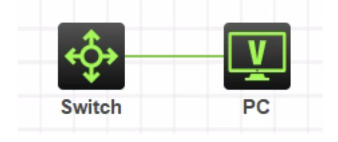
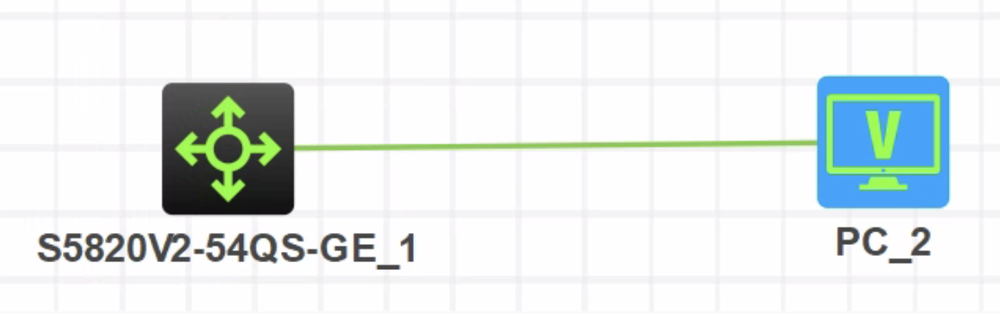
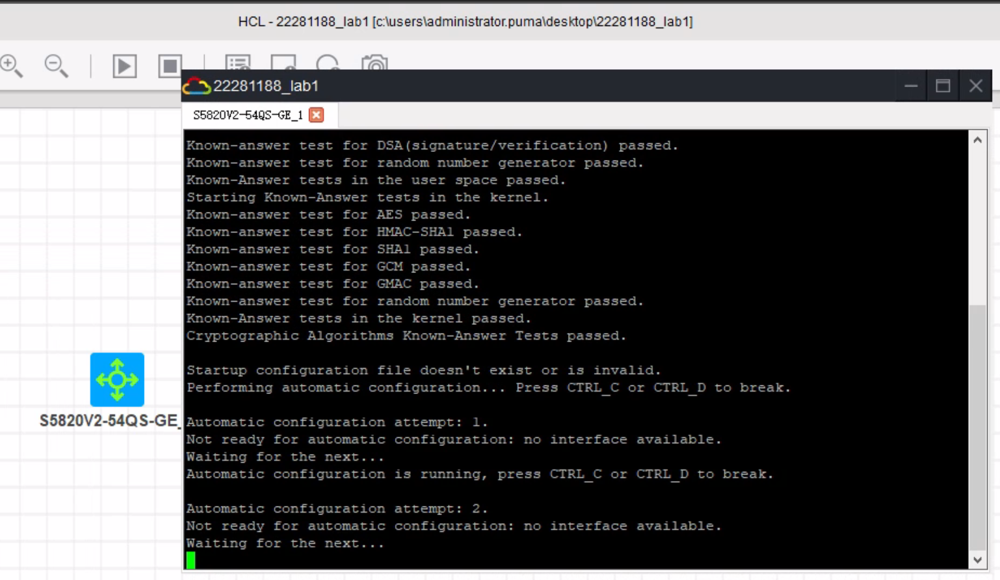
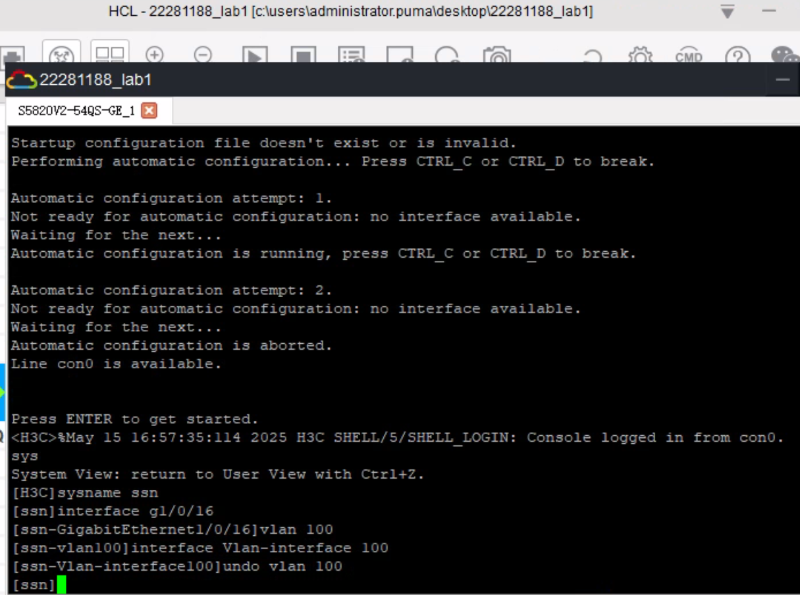
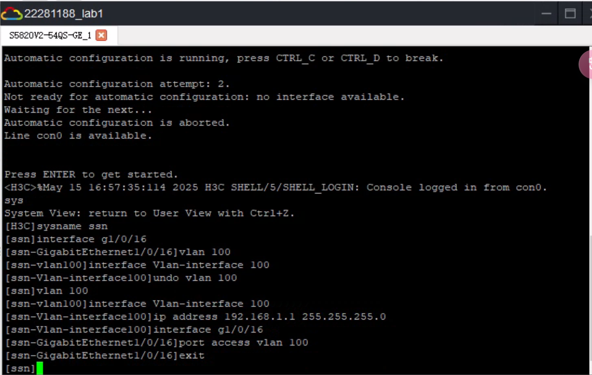
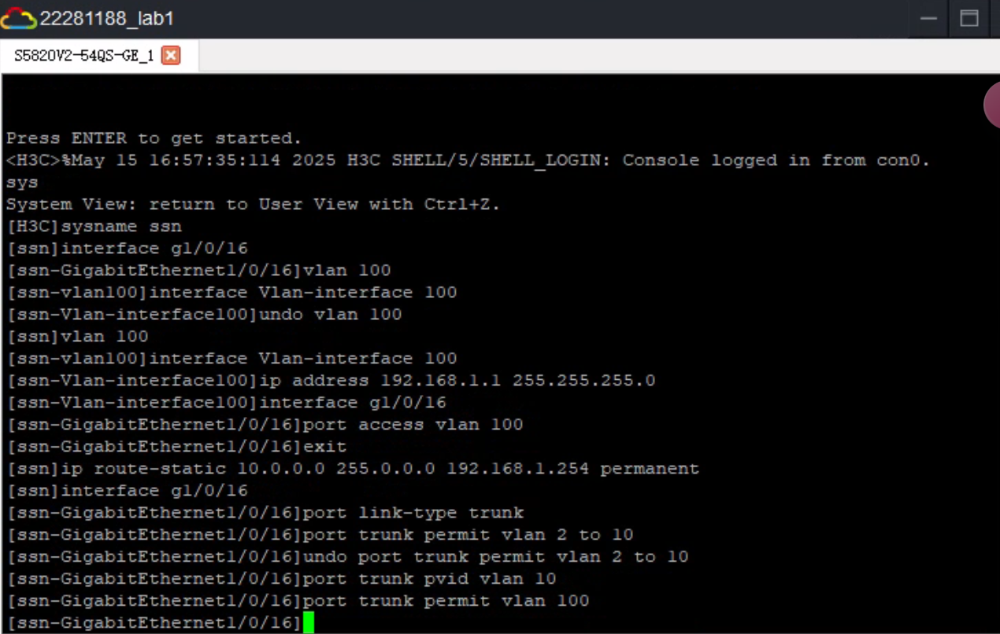
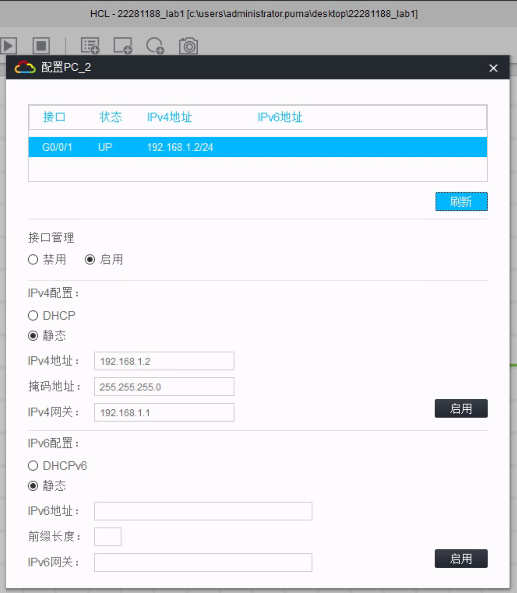
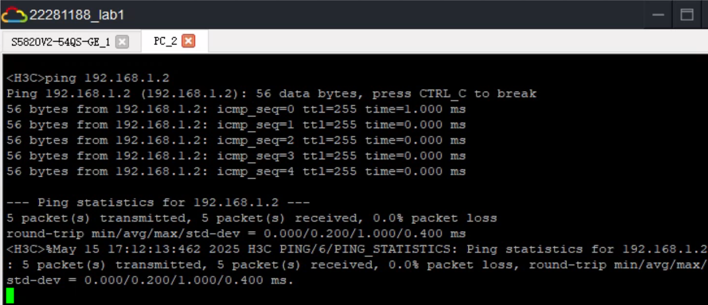
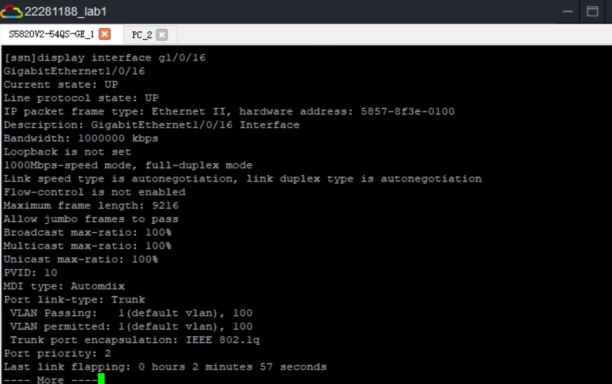

<h1 align = "center" style="font-size:40px">北京交通大学</h1>

<center style="font-size:18px">     课程名称：计算机网络原理</center>
<center style="font-size:18px">实验题目     ：仿真实验Lab1：交换机基本配置与管理</center>
<center style="font-size:18px">学号    ：22281188</center>
<center style="font-size:18px">姓名 ： 江家玮</center>
<center style="font-size:18px">班级 ： 计科2204班</center>
<center style="font-size:18px">指导老师 ： 张志飞老师</center>
<center style="font-size:18px">报告日期 ：2025-05-15</center>

------

[TOC]

 <div style="page-break-after: always;"></div>

# 计网仿真Lab1：交换机基本配置与管理

## 一、实验时间

2025年5月15日

## 二、实验地点

HCL (H3C Cloud Lab) 仿真实验平台

## 三、实验目的

1.  掌握交换机的基本信息查看方法。
2.  掌握交换机的基本配置管理，包括主机名配置、接口IP地址配置、VLAN创建与管理、Trunk端口配置等。
3.  熟悉交换机的带内管理方式。
4.  理解交换机在网络数据转发中的作用。

## 四、实验环境与设备

| 设备型号           | 数量 | 备注             |
| :----------------: | :--: | :--------------: |
| S5820V2-54QS-GE 交换机 | 1台  | HCL模拟设备      |
| VPC (虚拟PC)       | 1台  | 用于测试网络连通性 |

## 五、实验原理与基础知识

### 5.1 交换机的主要功能
交换机的主要功能是在网络中实现数据的传输和交换，提高网络的性能和效率。交换机可以根据数据帧中的MAC地址，将数据转发到目的端口，从而减少冲突和带宽消耗。交换机还可以支持一些高级功能，如VLAN（虚拟局域网）、链路聚合、QoS（服务质量）、安全等，满足不同网络场景的需求。

### 5.2 交换机管理方式
交换机管理方式主要分为两种：
1.  **带内管理**：启动设备后，在HCL操作界面或通过Console口连接设备，进入命令行终端进行管理。本实验主要采用此方式。
2.  **带外管理**：通过网络（如Telnet、SSH、Web界面）对交换机进行管理。通常需要先为交换机配置IP地址，使其能够接入网络。

## 六、实验内容与过程

### 6.1 实验拓扑搭建
根据实验要求，在HCL仿真软件中搭建如下图所示的网络拓扑。拓扑包括一台S5820V2-54QS-GE交换机和一台VPC。



实际搭建的拓扑如下所示：



### 6.2 交换机基本配置与命令练习

点击运行后，然后右键单击`S5820V2-54QS-GE_1`开启命令行：



#### 输入代码

```python
# 进入系统视图
sys
# 配置主机名
sysname ssn
# 进入以太网接口视图
interface g1/0/16
# 创建vlan100并进入vlan接口视图
vlan 100
interface Vlan-interface 100
# 删除vlan 100
undo vlan 100
```



继续输入指令：

```python
# 创建vlan100并进入vlan接口视图
vlan 100
interface Vlan-interface 100
# 配置 VLAN 接口的 IP 地址
ip address 192.168.1.1 255.255.255.0
# 进入16口的管理视图并分配给vlan100
interface g1/0/16
port access vlan 100
exit
```



```python
# 配置交换机网关地址/配置静态路由
ip route-static 10.0.0.0 255.0.0.0 192.168.1.254 permanent
# 配置端口的链路类型为 Trunk 类型。
interface g1/0/16
port link-type trunk
# 新增允许通过的vlan范围
port trunk permit vlan 2 to 10
# 将以上 Trunk 端口加入到一个或多个 VLAN
# 以实现允许来自指定 VLAN 的数据包通过，多次使用取并集
# 将Trunk端口从指定的VLAN中删除：
undo port trunk permit vlan 2 to 10
# 设置Trunk端口的默认VLAN：
port trunk pvid vlan 10
port trunk permit vlan 100
```



#### 验证并ping通

选择连线，将`GE_0/16`口与`PC`的唯一接口连起来

而后进行PC的配置如图：



启动PC的命令行，`ping 192.168.1.2`



分别用以下命令在交换机上面查看端口状态：

```python
# 查看交换机16接口的命令
display interface g1/0/16
```



**通过这张图分析以下信息**
接口 `GigabitEthernet1/0/16 `状态分析：

- **状态** :
  - Current state: UP
  - Line protocol state: UP
- **速度和双工模式** :
  - 1000Mbps-speed mode, full-duplex mode
  - Autonegotiation 启用
- **VLAN 配置** :
  - Port link-type: Trunk
  - VLAN Passing: 1(default vlan), 100
  - VLAN permitted: 1(default vlan), 100
- **结论:**
  - 接口 `GigabitEthernet1/0/16 `已成功连接，并配置为Trunk模式，允许VLAN 1和100通过。
  - PC连接到此接口，应能ping通交换机VLAN 100的IP地址（192.168.1.1）。

## 七、实验结果与分析

### 7.1 Ping测试结果分析
如果VPC能够成功ping通交换机的VLAN 100接口IP地址 `192.168.1.1`，则表明：
1.  VPC的IP地址、子网掩码、网关配置正确。
2.  交换机VLAN 100接口的IP地址配置正确。
3.  交换机`GigabitEthernet1/0/16`端口已正确划入VLAN 100 (作为Access口时) 或允许VLAN 100通过 (作为Trunk口，且VPC发送的数据包未打标签时，需要PVID为100，或者PC本身能发送带VLAN 100标签的帧)。
    * 根据实验步骤，`GigabitEthernet1/0/16`最终配置为Trunk口，PVID为VLAN 10，但允许VLAN 100通过。这意味着如果PC发送不带标签的帧，交换机会将其视为VLAN 10的帧。如果PC发送带VLAN 100标签的帧，则可以通信。对于普通PC，通常发送不带标签的帧。因此，若要PC (192.168.1.2/24) 与交换机VLAN 100接口 (192.168.1.1/24) 通信，当G1/0/16为Trunk口时，其PVID应为100。

## 八、实验心得与总结

通过本次实验，我掌握了HCL仿真环境下H3C交换机的基本配置方法。主要收获如下：
1.  **熟悉了交换机的基本操作流程**：包括进入系统视图、接口视图、VLAN视图等，以及如何配置主机名。
2.  **掌握了VLAN的创建与管理**：理解了VLAN的作用以及如何在交换机上创建VLAN，并将端口划入指定的VLAN（Access模式）。
3.  **理解了VLAN接口的配置**：学会了为VLAN配置IP地址，使其能够作为网关或管理接口。
4.  **掌握了Trunk端口的配置**：了解了Trunk端口的作用（允许多个VLAN的流量通过），以及如何配置端口为Trunk模式、设置PVID和允许通过的VLAN列表。
5.  **学习了基本的连通性测试方法**：通过配置VPC的IP地址并使用ping命令，验证了网络配置的正确性。
6.  **熟悉了交换机状态查看命令**：例如`display interface`命令，能够帮助分析端口状态和排查故障。

实验过程中也遇到了一些问题，例如对于Trunk口PVID的理解。当连接PC这类通常不发送带VLAN标签的设备时，Trunk口的PVID设置至关重要，它决定了这些不带标签的流量属于哪个VLAN。如果PVID设置不当，可能导致PC无法与目标VLAN的设备或接口通信。通过查阅资料和反复测试，加深了对相关概念的理解。
