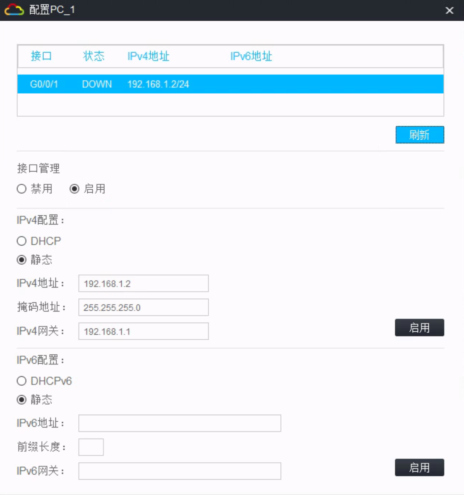
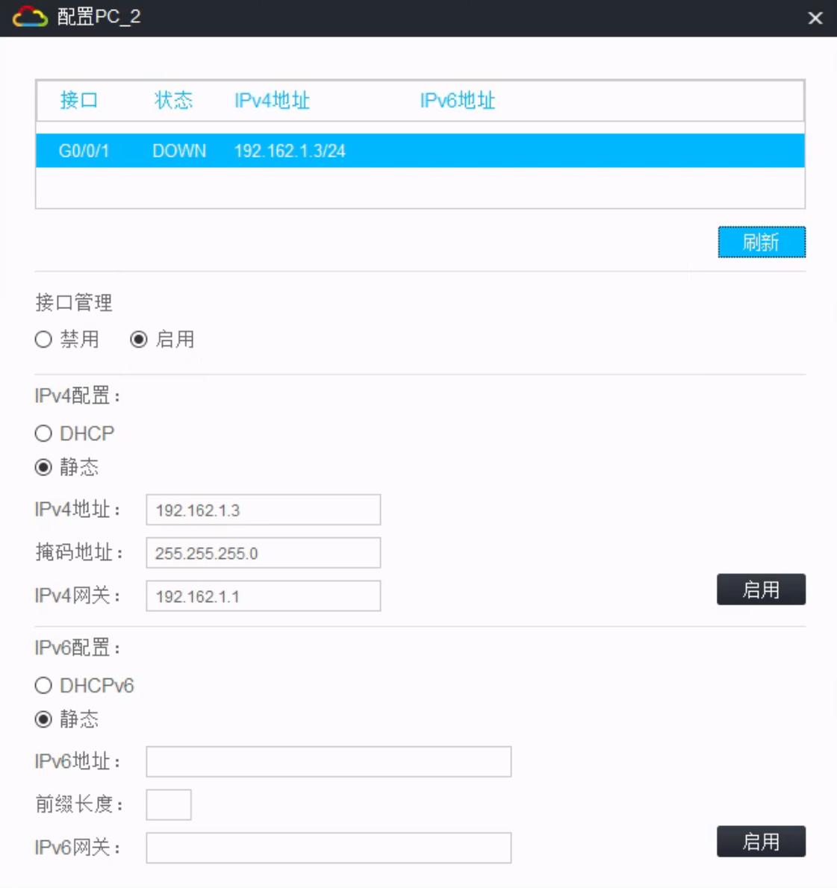
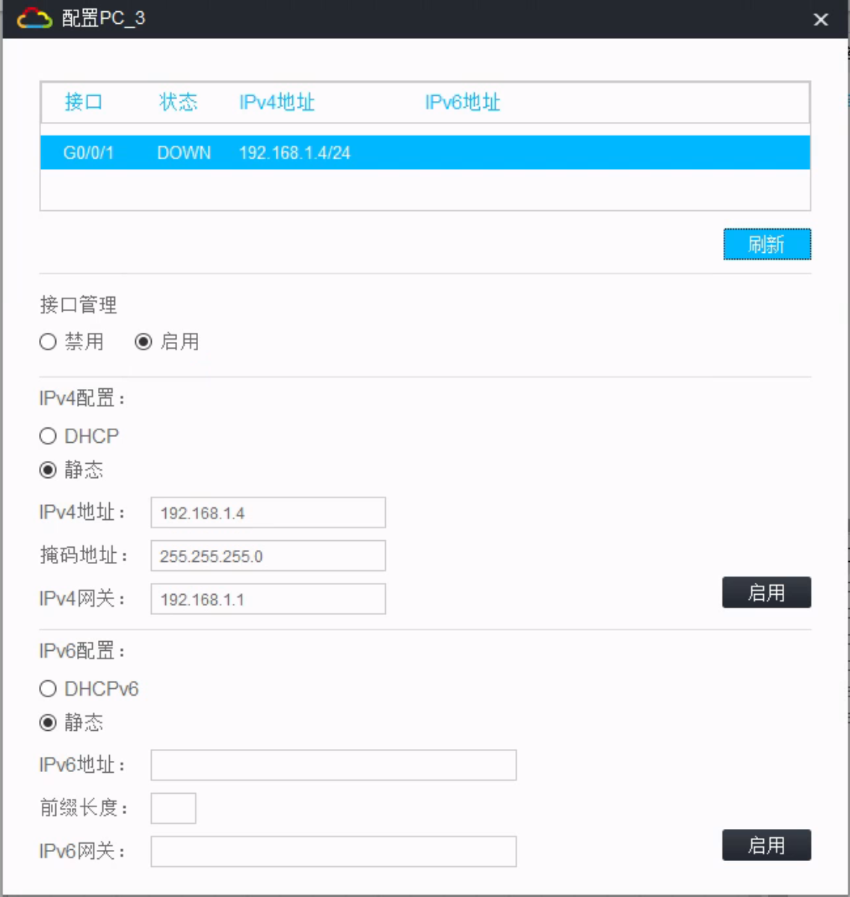
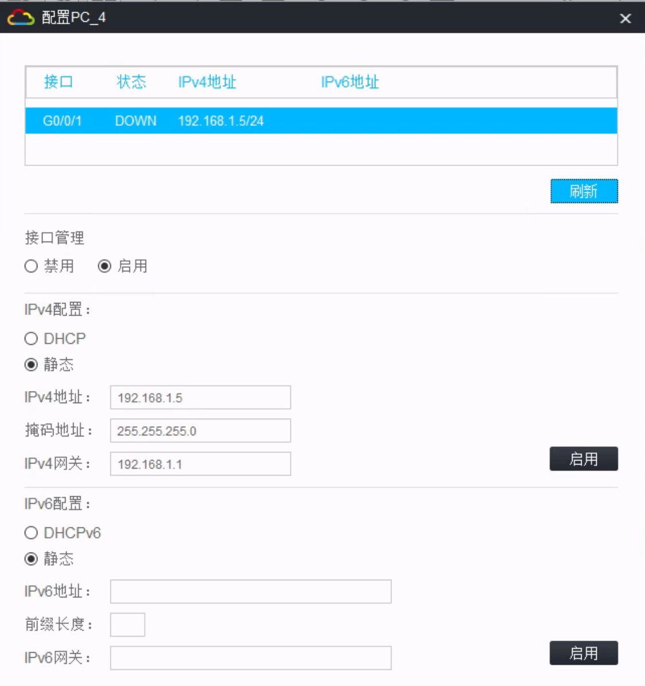
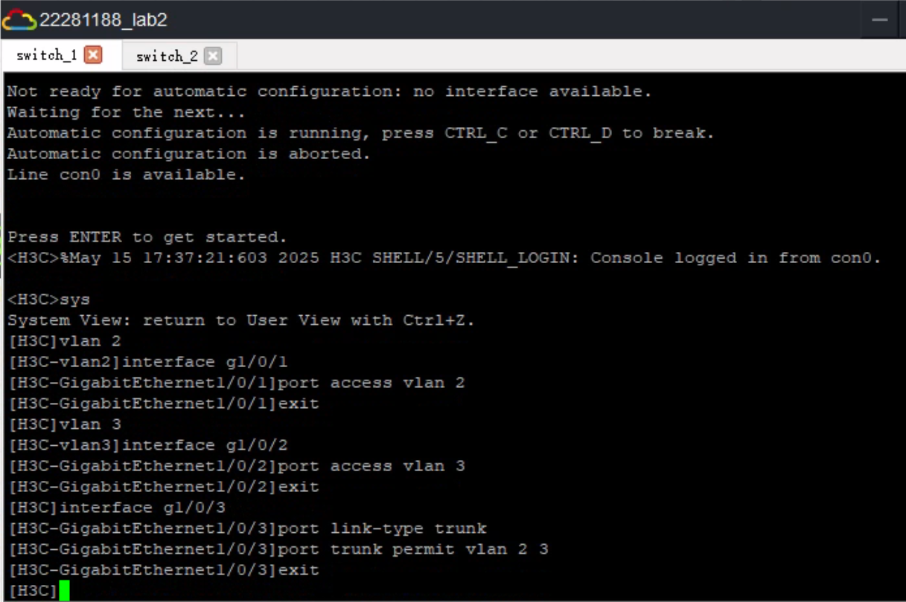
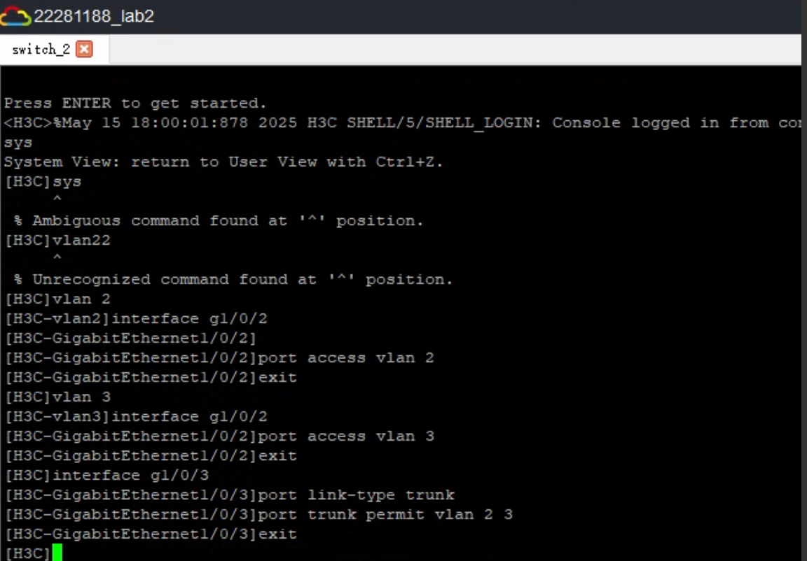
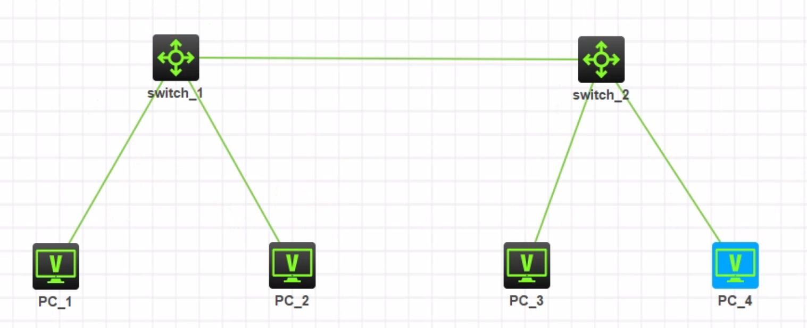
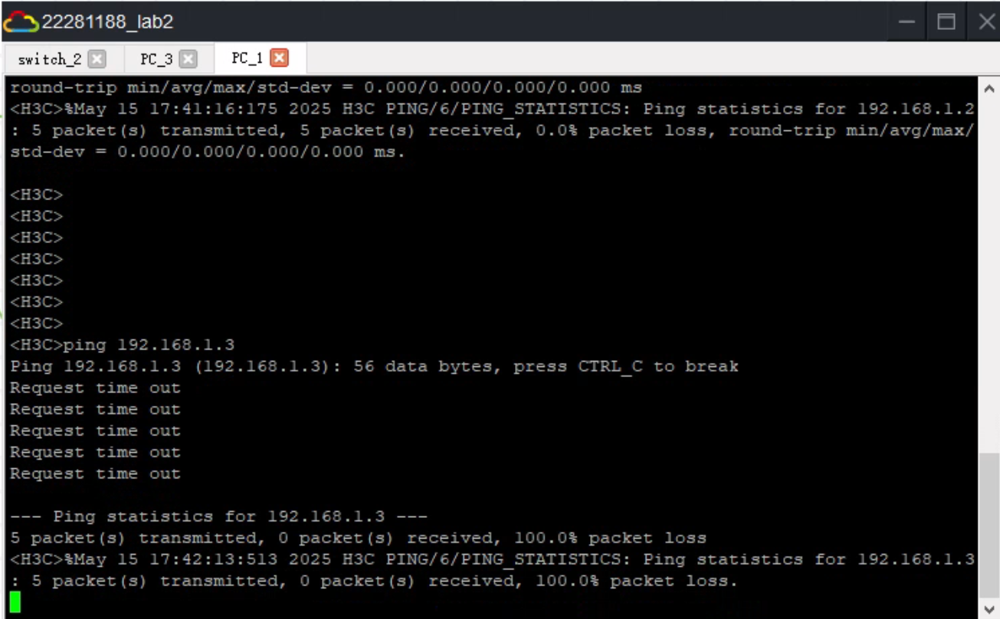
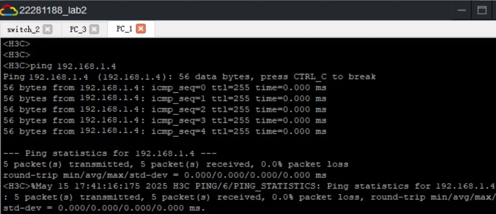

<h1 align = "center" style="font-size:40px">北京交通大学</h1>

<center style="font-size:18px">     课程名称：计算机网络原理</center>
<center style="font-size:18px">实验题目     ：仿真实验Lab2：交换机划分VLAN配置</center>
<center style="font-size:18px">学号    ：22281188</center>
<center style="font-size:18px">姓名 ： 江家玮</center>
<center style="font-size:18px">班级 ： 计科2204班</center>
<center style="font-size:18px">指导老师 ： 张志飞老师</center>
<center style="font-size:18px">报告日期 ：2025-05-15</center>

------
[TOC]


# 实验二 交换机划分 VLAN 配置

## 一、实验时间

2025年5月15日

## 二、实验地点

HCL (H3C Cloud Lab) 仿真实验平台

## 三、实验目的

理解虚拟LAN (VLAN) 的基本概念和作用。

掌握交换机基于端口划分VLAN的配置方法。

验证VLAN间的隔离特性以及同VLAN内的通信。

掌握Trunk端口的配置和作用，实现跨交换机的VLAN通信。

## 四、实验原理与基础知识

### 4.1 VLAN概述

VLAN (Virtual Local Area Network，虚拟局域网) 是指在一个物理网络的基础上，通过逻辑方式将其划分为多个独立的广播域（即虚拟的局域网）。每个VLAN都是一个独立的逻辑网络，VLAN内的设备可以自由通信，而不同VLAN间的设备默认是隔离的，不能直接通信，若要通信必须通过路由器或三层交换机进行转发。

VLAN的主要优点包括：

+ 隔离广播域：限制广播流量在VLAN内部，减少广播风暴的影响，提高网络性能。
+ 增强网络安全性：不同VLAN的用户无法直接访问，提高了网络的安全性。
+ 灵活的网络管理：用户可以根据部门、应用等逻辑分组，而不受物理位置的限制。

### 4.2 基于端口划分VLAN

基于端口划分VLAN (Port-based VLAN) 是最常用的一种VLAN实现方式。交换机的每个端口被分配到一个特定的VLAN。从该端口接收到的数据帧都属于该VLAN，也只能转发到属于同一VLAN的端口或Trunk端口。一个端口通常只能属于一个VLAN (作为Access口时)。

### 4.3 Trunk端口

当需要在交换机之间传递多个VLAN的数据时，需要使用Trunk端口。Trunk端口可以承载来自多个VLAN的流量。数据帧在Trunk链路上传输时，通常会使用IEEE 802.1Q协议打上VLAN标签，以区分不同VLAN的数据。

## 五、实验环境与设备

|        设备型号        | 数量 |        备注        |
| :--------------------: | :--: | :----------------: |
| S5820V2-54QS-GE 交换机 | 2台  |    HCL模拟设备     |
|      VPC (虚拟PC)      | 4台  | 用于测试网络连通性 |

## 六、实验内容与过程

#### 6.1 分配次启动PC并配置

`PC_1`配置：

|  配置项  |      值       |
| :------: | :-----------: |
| IP 地址  |  192.168.1.2  |
| 子网掩码 | 255.255.255.0 |
| 默认网关 |  192.168.1.1  |



`PC_2`配置：

|  配置项  |      值       |
| :------: | :-----------: |
| IP 地址  |  192.168.1.3  |
| 子网掩码 | 255.255.255.0 |
| 默认网关 |  192.168.1.1  |



`PC_3`配置：

|  配置项  |      值       |
| :------: | :-----------: |
| IP 地址  |  192.168.1.4  |
| 子网掩码 | 255.255.255.0 |
| 默认网关 |  192.168.1.1  |



`PC_4`配置：

|  配置项  |      值       |
| :------: | :-----------: |
| IP 地址  |  192.168.1.5  |
| 子网掩码 | 255.255.255.0 |
| 默认网关 |  192.168.1.1  |



#### 6.2 Switch 1

```python
sys # 进入系统视图
vlan 2 # 创建 VLAN 2
interface g1/0/1 # 进入接口
port access vlan 2 # 将 GE_0/1 接口加入 VLAN2
exit
vlan 3 # 创建 VLAN 3
interface g1/0/2 # 进入接口
port access vlan 3 # 将 GE_0/2 接口加入 VLAN3
exit
interface g1/0/3 # 进入接口
port link-type trunk # Switch 互联接口类型设置为 trunk
port trunk permit vlan 2 3
exit
```



#### 6.3 Switch 2

```python
sys
vlan 2 # 创建 VLAN 2
interface g1/0/1 # 进入接口
port access vlan 2 # 将 GE_0/1 接口加入 VLAN2
exit
vlan 3 # 创建 VLAN 3
interface g1/0/2 # 进入接口
port access vlan 3 # 将 GE_0/2 接口加入 VLAN3
exit
interface g1/0/3 # 进入接口
port link-type trunk # Switch 互联接口类型设置为 trunk
port trunk permit vlan 2 3
exit
```



#### 6.4 分析与连线



```markdown
- Switch_1 port GE_0/3 <------> Switch_2 port GE_0/1
- Switch_1 port GE_0/1 <------> PC_1
- Switch_1 port GE_0/2 <------> PC_2
- Switch_2 port GE_0/2 <------> PC_3
- Switch_2 port GE_0/3 <------> PC_4
```

#### 6.5 测试

```
display vlan brief # 查看vlan及接口
PC1 ping PC2 timeout
PC1 ping PC3 access
```

##### PC1 ping PC2 timeout



##### PC1 ping PC3 access

这是成功ping：



## 七、实验心得与总结

通过本次实验，深入地理解了VLAN技术及其在网络中的应用。主要收获如下：

掌握了VLAN的创建和端口划分：学会了如何在H3C交换机上创建VLAN，并将Access端口明确地划分到指定的VLAN中。

验证了VLAN的隔离特性：通过ping测试，直观地看到了同一交换机上不同VLAN间的设备是无法直接通信的，这体现了VLAN在隔离广播域和增强安全性方面的作用。

理解了Trunk端口的配置和功能：学会了如何配置Trunk端口以及port trunk permit vlan命令的用法，使得特定VLAN的流量可以在交换机之间传递，实现了跨交换机的同VLAN通信。

实践了网络故障排查的基本思路：如果ping不通，需要检查IP配置、VLAN划分、端口状态以及Trunk链路的配置是否正确。display vlan brief 和 display interface 等命令对于验证配置非常有用。
