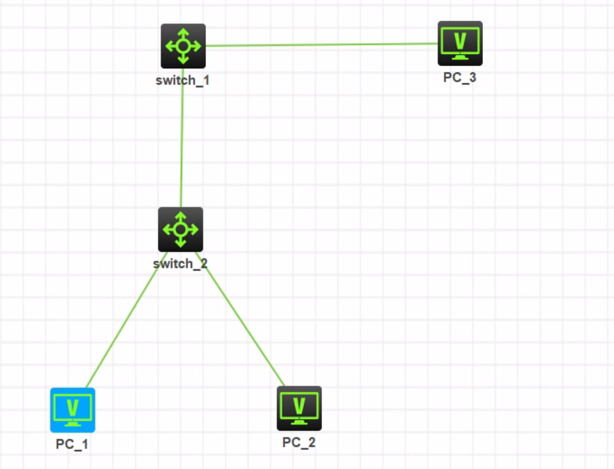
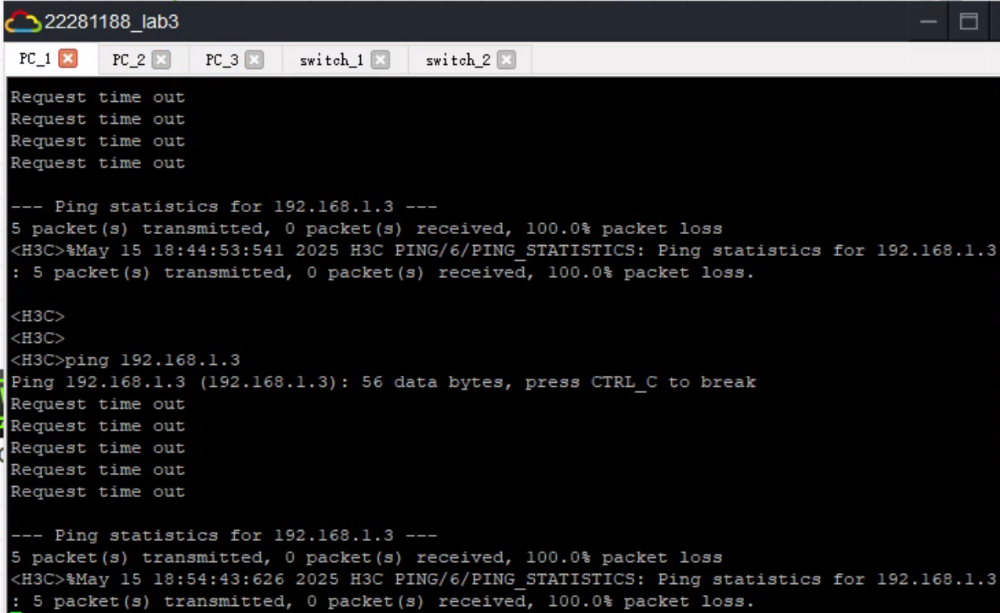

<h1 align = "center" style="font-size:40px">北京交通大学</h1>

<center style="font-size:18px">		课程名称：计算机网络原理</left>
<center style="font-size:18px">实验题目     ：仿真实验三_利用三层交换机实现 VLAN 间路由</center>
<center style="font-size:18px">学号    ：22281188</center>
<center style="font-size:18px">姓名 ： 江家玮</center>
<center style="font-size:18px">班级 ： 计科2204班</center>
<center style="font-size:18px">指导老师 ： 张志飞老师</center>
<center style="font-size:18px">报告日期 ：2025-05-15</center>


------

[TOC]


 <div style="page-break-after: always;"></div>

# 实验三 利用三层交换机实现 VLAN 间路由

## 一、实验时间

2025年5月15日 

## 二、实验地点

HCL (H3C Cloud Lab) 仿真实验平台

## 三、实验目的

1. 掌握交换机 Tagged VLAN (Trunk链路) 的配置。
2. 掌握三层交换机基本配置方法。
3. 掌握三层交换机 VLAN 路由的配置方法，特别是SVI（交换虚接口）的配置。
4. 通过三层交换机实现不同VLAN间的相互通信。

## 四、实验原理与基础知识

### 4.1 三层交换技术

三层交换机在二层交换机的基础上增加了路由功能，即网络层的功能。它能够识别IP地址并根据路由表进行数据包转发决策。

### 4.2 VLAN间路由

默认情况下，不同VLAN之间的设备是相互隔离的，不能直接通信。要实现VLAN间的通信，就需要路由功能。三层交换机通过创建SVI（Switched Virtual Interface，交换虚接口或VLAN接口）并为每个SVI配置IP地址来实现VLAN间的路由。每个SVI对应一个VLAN，并作为该VLAN内设备的默认网关。当数据包需要从一个VLAN转发到另一个VLAN时，会发送到其默认网关（即源VLAN的SVI），三层交换机根据目标IP地址查询路由表，并将数据包转发到目标VLAN对应的SVI，再由目标SVI将数据包发送到目标设备。

### 4.3 Trunk链路

Trunk链路用于在交换机之间或交换机与路由器之间承载多个VLAN的流量。在本实验中，二层交换机与三层交换机之间的连接需要配置为Trunk链路，以允许VLAN 2和VLAN 3的数据通过。

## 五、实验环境与设备

根据实验要求，所需设备如下：

|        设备型号        | 数量 |          备注          |
| :--------------------: | :--: | :--------------------: |
| S5820V2-54QS-GE 交换机 | 2台  | 一台作二层，一台作三层 |
|      VPC (虚拟PC)      | 3台  |   用于测试网络连通性   |

## 六、实验内容与过程

### 6.1 配置PC1、2、3

**PC_1配置：**

|  配置项  |      值       |
| :------: | :-----------: |
| IP 地址  |  192.168.1.2  |
| 子网掩码 | 255.255.255.0 |
| 默认网关 |  192.168.1.1  |


**PC_2配置：**

| 配置项   | 值            |
| -------- | ------------- |
| IP 地址  | 192.168.1.3   |
| 子网掩码 | 255.255.255.0 |
| 默认网关 | 192.168.1.1   |


**PC_3配置：**

| 配置项   | 值            |
| -------- | ------------- |
| IP 地址  | 192.168.1.4   |
| 子网掩码 | 255.255.255.0 |
| 默认网关 | 192.168.1.1   |


#### Switch_1 配置

```python
sys
interface g1/0/1
port link-type trunk
port trunk permit vlan 2 3
exit

vlan 2
exit

vlan 3
exit

int g1/0/2
port access vlan 2
exit
```


#### Switch_2 配置

```python
sys
vlan 2
exit
interface g1/0/2
port access vlan 2
exit

vlan 3
exit
interface g1/0/3
port access vlan 3
exit

interface g1/0/1
port link-type trunk
port trunk permit vlan 2 3
exit
```


#### 连线



```
- Switch_1 g1/0/1 <------> Switch_2 g1/0/1
- Switch_1 g1/0/2 <------> PC_3
- Switch_2 g1/0/2 <------> PC_1
- Switch_2 g1/0/3 <------> PC_2
```

### 6.2 验证二层交换机 VLAN2,VALN3 下的主机之间可以相互通信

- PC_1 和 PC_3 在 VLAN 2 中。
- PC_2 在 VLAN 3 中。

##### 同一VLAN内的PC通信

**从PC_1 ping PC_3** (VLAN 2)

```python
ping 192.168.1.4
```

预期结果：ping 通


**从PC_3 ping PC_1** (VLAN 2)

在PC_3上运行以下命令：

```python
ping 192.168.1.2
```

预期结果：ping 通


##### 测试不同VLAN之间的隔离

**从PC_1 ping PC_2** (VLAN 2 和 VLAN 3)

在PC_1上运行以下命令

```python
ping 192.168.1.3
```

预期无法ping通




**从PC_3 ping PC_2** (VLAN 2 和 VLAN 3)

在PC_3上运行以下命令：

```python
ping 192.168.1.3
```

预期无法ping通


## 七、实验心得与总结

通过本次实验，我对三层交换机实现VLAN间路由的原理和配置方法有了更深入的理解。

1. **掌握了SVI的配置**：核心在于为每个需要路由的VLAN创建SVI，并为其配置IP地址作为该VLAN的网关。这是实现VLAN间通信的关键。
2. **理解了IP子网规划的重要性**：为了实现VLAN间路由，每个VLAN必须属于不同的IP子网。PC的IP地址和默认网关必须正确配置，指向其所在VLAN对应的SVI地址。
3. **巩固了Trunk链路的配置**：在二层交换机和三层交换机之间正确配置Trunk链路，并允许相关VLAN通过，是保证VLAN数据能够到达三层路由引擎的前提。
4. **验证了三层交换机的路由功能**：通过ping测试，成功观察到在正确配置三层交换机后，原先隔离的不同VLAN间的设备可以相互通信。

实验过程中，清晰的IP地址规划和正确的网关设置是非常重要的。如果PC的网关设置错误，或者SVI的IP地址配置不当，VLAN间路由将无法实现。此外，确保Trunk链路上允许了所有参与路由的VLAN也同样关键。