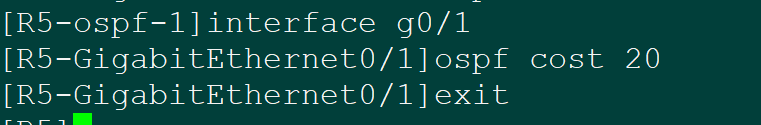
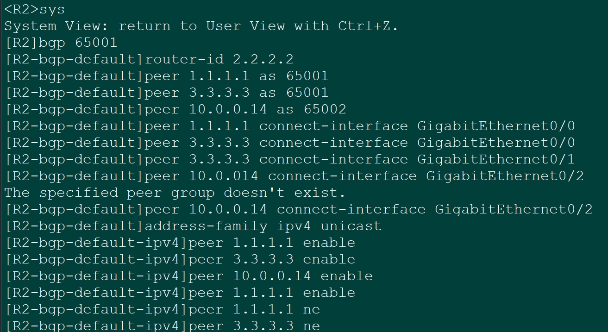
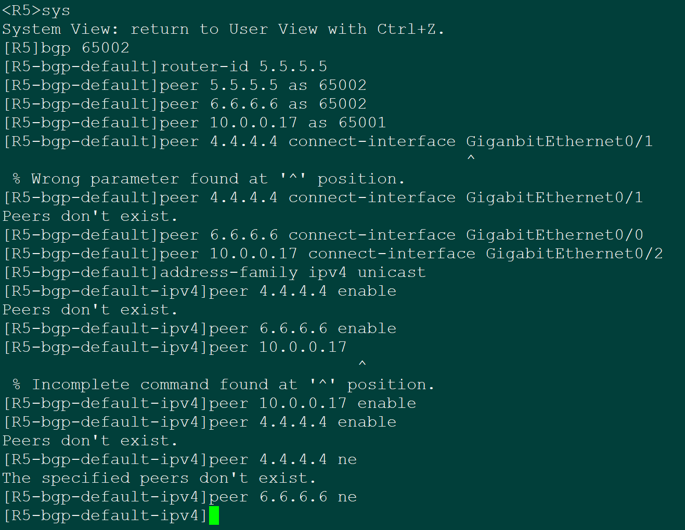

<h1 align = "center" style="font-size:40px">北京交通大学</h1>

<center style="font-size:18px">     课程名称：计算机网络原理</left>
<center style="font-size:18px">实验题目     ：计网仿真实验12</center>
<center style="font-size:18px">学号    ：22281188</center>
<center style="font-size:18px">姓名 ： 江家玮</center>
<center style="font-size:18px">班级 ： 计科2204班</center>
<center style="font-size:18px">指导老师 ： 张志飞老师</center>
<center style="font-size:18px">报告日期 ：2025-05-27</center>


------

[TOC]


 <div style="page-break-after: always;"></div>

# 计网仿真Lab12

## 一、实验时间

实验时间：2025-05-27

## 二、实验地点

本地HCL

## 三、实验目的

本次实验旨在构建一个模拟企业网络环境，涵盖总公司、分公司及办事处，并通过综合运用多种网络协议和技术，实现以下目标：

1. **掌握BGP协议的应用：**
   - 配置并验证总公司（AS 65001）与分公司（AS 65002）之间的EBGP邻居关系，实现跨自治系统的路由互通。
   - 在各AS内部署IBGP，并使用对等体组（Peer Group）简化配置，确保AS内路由的可靠传播。
   - 宣告总公司和分公司的业务网段到BGP中。
2. **掌握OSPF协议的应用：**
   - 在总公司和分公司内部配置OSPF协议，为IBGP邻居建立提供TCP可达性，但不宣告业务网段。
   - 通过调整链路的OSPF Cost值，避免产生等价路由，控制内部流量路径。
3. **掌握RIPv2协议的应用：**
   - 在总公司与办事处之间配置RIPv2协议，实现办事处网络的连通性。
4. **掌握路由控制与策略：**
   - 通过修改BGP的AS_PATH属性，实现总公司与分公司间A流数据（经R2-R4）和B流数据（经R3-R5）的负载均衡和路径选择。
   - 在R2上实现RIP和BGP协议的双向路由引入，确保办事处的A流和B流数据均能与总公司互通。
   - 通过路由过滤策略，控制办事处与分公司之间的路由学习，使得办事处与分公司之间仅A流能够互通。
5. **掌握网络安全与优化：**
   - 配置静默接口（Silent Interface），禁止在业务网段发送协议报文，减少不必要的网络开销和安全风险。
   - 过滤不相关的RIP协议报文。
   - 配置策略，使得总公司只向分公司发布属于本AS的路由，以满足未来业务扩展需求并禁止分公司之间的互访。
6. **熟悉网络规划与地址配置：**
   - 按照拓扑图合理配置设备IP地址，包括接口地址和Loopback0接口地址（用作OSPF Router-ID和IBGP邻居建立）。

## 四、实验内容

#### 4.1 实验背景知识

本实验综合运用了多种路由协议和网络技术，核心知识点包括：

1. **边界网关协议 (BGP - Border Gateway Protocol):**
   - **定义：** BGP是一种用于自治系统（AS）之间的动态路由协议，是互联网的核心路由协议。它主要负责在不同的AS之间交换网络可达性信息。
   - **类型：**
     - **EBGP (External BGP):** 运行在不同AS的路由器之间。本实验中，总公司AS 65001与分公司AS 65002之间的BGP连接即为EBGP。
     - **IBGP (Internal BGP):** 运行在同一AS内部的路由器之间。为防止路由环路，IBGP要求AS内部的BGP路由器建立全连接（Full Mesh）或采用路由反射器（Route Reflector）、联盟（Confederation）等技术。本实验中使用全连接，并通过对等体组简化配置。
   - **特点：**
     - 可靠性：使用TCP（端口179）作为传输层协议。
     - 路径向量协议：BGP通过维护AS路径（AS_PATH）来避免路由环路，并作为路径选择的重要依据。
     - 策略驱动：BGP具有丰富的路径属性和强大的路由策略能力，可以灵活控制路由的选择和通告。
   - **常用属性：**
     - `AS_PATH`：记录路由经过的AS序列号，用于防环和路径选择。本实验通过修改此属性影响流量路径。
     - `NEXT_HOP`：指示到达目标网络的下一跳路由器IP地址。
     - `LOCAL_PREF`：用于在AS内部选择离开AS的最佳路径，仅在IBGP邻居间传递。
     - `MED (Multi-Exit Discriminator)`：用于影响其他AS选择进入本AS的路径。
   - **Loopback接口建邻：** 在IBGP中，通常使用Loopback接口的IP地址建立邻居关系，因为Loopback接口稳定，不易受物理接口故障影响。
2. **开放最短路径优先协议 (OSPF - Open Shortest Path First):**
   - **定义：** OSPF是一种广泛使用的内部网关协议（IGP），基于链路状态算法（Dijkstra算法）。
   - **特点：**
     - 无环路：通过SPF算法计算最短路径树，避免路由环路。
     - 快速收敛：网络变化时能快速重新计算路由。
     - 支持VLSM和CIDR。
     - 分层结构：通过区域（Area）划分，减小路由表规模和LSA（链路状态通告）泛洪范围。本实验中所有OSPF路由器均在Area 0（骨干区域）。
   - **Router-ID：** OSPF路由器在自治系统中的唯一标识，通常手动配置或自动选举（如使用Loopback接口IP地址）。
   - **Cost：** OSPF使用Cost作为路径选择的度量值。本实验通过修改接口Cost来影响路径选择，避免等价路由。
   - **用途：** 在本实验中，OSPF主要用于AS内部的路由可达性，为IBGP邻居之间建立TCP连接提供基础。
3. **路由信息协议版本2 (RIPv2 - Routing Information Protocol version 2):**
   - **定义：** RIP是一种距离矢量路由协议，使用跳数（Hop Count）作为度量值。
   - **RIPv2特点：**
     - 支持VLSM（可变长子网掩码）和CIDR（无类别域间路由）。
     - 使用组播地址（224.0.0.9）发送路由更新。
     - 支持明文和MD5认证。
     - 最大跳数为15，16表示不可达。
   - **`no summary` / `undo summary`：** 关闭自动汇总功能，以支持不连续子网。
   - **用途：** 本实验中用于连接办事处与总公司。
4. **路由引入 (Route Redistribution):**
   - **定义：** 在一个运行多种路由协议的网络中，将一种路由协议学习到的路由信息通告给另一种路由协议的过程。
   - **必要性：** 使得不同协议域之间的网络能够互通。本实验在R2上将RIP路由引入BGP，并将BGP路由引入RIP。
   - **注意事项：** 路由引入可能导致次优路径、路由环路等问题，需要谨慎配置，并配合路由策略进行控制。BGP引入IGP路由时，默认只引入EBGP学习到的路由，若需引入IBGP路由，需特殊配置（如实验中的`import-route bgp allow-ibgp`）。
5. **路由策略 (Route-Policy) / 路由图 (Route-Map):**
   - **定义：** 一种用于过滤和修改路由信息的工具。通过匹配特定条件的路由，并对匹配的路由执行相应的策略（如允许、拒绝、修改属性）。
   - **组成：** 通常由多个节点（node）组成，按顺序匹配。每个节点包含`if-match`（匹配条件）和`apply`（执行动作）子句。
   - **应用场景：**
     - 控制路由的接收和发布。
     - 修改路由属性（如AS_PATH、MED、Local-Pref等）。
     - 实现策略路由。
   - **本实验应用：**
     - 在R2和R4上，针对A流（源自172.16.0.0/16和172.16.1.0/24）的路由，在向EBGP邻居发布时，通过`apply as-path 200 additive`（或类似命令，具体看设备厂商，参考配置中是`apply as-path 200`，可能意为增加AS号200）来增加AS_PATH长度，使其路径看起来更长，从而引导B流走另一条路径。
     - 在R3和R5上，针对B流（源自192.168.0.0/16和192.168.1.0/24）的路由，通过`apply as-path 100 additive`来增加AS_PATH长度。
     - **注意：** 参考配置中对A流和B流的AS_PATH修改似乎是为了让特定流量选择特定路径，但AS_PATH越短越优。若要使A流走R2-R4，B流走R3-R5，则在对端（如R4向R2，R5向R3）发布相应业务网段时，需要让不希望被选择的路径AS_PATH更长。或者在入口路由器（R2, R3）上对从EBGP邻居（R4, R5）学到的路由设置不同的Local_Pref（AS内部）或影响MED（对其他AS）。实验要求中是通过修改AS_PATH，可能是指在出口方向修改AS_PATH，使得对端AS在选择路径时产生偏好。
6. **访问控制列表 (ACL - Access Control List):**
   - **定义：** 一系列有序的规则，用于定义哪些数据包可以被允许或拒绝通过网络设备接口。
   - **类型：** 基本ACL（只匹配源IP）、高级ACL（匹配源/目的IP、协议、端口等）。
   - **用途：**
     - 流量过滤：控制网络访问。
     - 与路由策略配合：用于识别特定流量或路由前缀。
   - **本实验应用：**
     - 用于匹配A流和B流的源IP地址，以便在路由策略中对它们应用不同的AS_PATH修改。
     - 用于过滤办事处与分公司之间的B流流量（例如，在R2上配置ACL，结合`filter-policy`或`packet-filter`应用）。
7. **静默接口 (Silent Interface):**
   - **定义：** 配置了静默接口后，该接口将不再发送特定路由协议的更新报文，但仍能接收和处理这些报文。
   - **用途：**
     - 安全：防止在不信任的网络或用户网段泄露路由信息。
     - 性能：减少不必要的协议流量。
   - **本实验应用：** 在连接业务网段的接口（如R2连接PC的接口，R7的业务接口）上配置，避免OSPF或RIP报文发送到这些网段。
8. **AS-Path Filter (AS路径过滤器):**
   - **定义：** 一种基于BGP AS_PATH属性进行路由过滤的机制，通常使用正则表达式来匹配AS_PATH。
   - **用途：** 控制哪些BGP路由可以被接收或通告。
   - **本实验应用：** 在R2和R3上配置`ip as-path-filter 1 permit ^$`，并应用于对EBGP邻居的`export`策略。`^$`表示匹配空的AS_PATH，即只允许通告源于本AS的路由（尚未经过其他AS的路由），这可以防止将从一个分公司学到的路由通告给另一个分公司。

## 五、实验过程

### 5.1 **IP配置说明**

```
[R1-GigabitEthernet0/0]ip address 10.0.0.1 255.255.255.252
[R1-GigabitEthernet0/1]ip address 10.0.0.5 255.255.255.252

[R2-GigabitEthernet0/0]ip address 10.0.0.2 255.255.255.252
[R2-GigabitEthernet0/1]ip address 10.0.0.9 255.255.255.252
[R2-GigabitEthernet0/2]ip address 10.0.0.13 255.255.255.252
[R2-GigabitEthernet5/0]ip address 10.0.0.34 255.255.255.252

[R3-GigabitEthernet0/0]ip address 10.0.0.10 255.255.255.252
[R3-GigabitEthernet0/1]ip address 10.0.0.10 255.255.255.252
[R3-GigabitEthernet0/2]ip address 10.0.0.17 255.255.255.252

[R4-GigabitEthernet0/2]ip address 10.0.0.14 255.255.255.252
[R4-GigabitEthernet0/1]ip address 10.0.0.21 255.255.255.252
[R4-GigabitEthernet0/0]ip address 10.0.0.25 255.255.255.252

[R5-GigabitEthernet0/2]ip address 10.0.0.18 255.255.255.252
[R5-GigabitEthernet0/0]ip address 10.0.0.29 255.255.255.252
[R5-GigabitEthernet0/1]ip address 10.0.0.22 255.255.255.252

[R6-GigabitEthernet0/0]ip address 10.0.0.26 255.255.255.252
[R6-GigabitEthernet0/1]ip address 10.0.0.30 255.255.255.252

ip address 10.0.0.33 255.255.255.252
```

#### 5.1.1 配置[OSPF](https://so.csdn.net/so/search?q=OSPF&spm=1001.2101.3001.7020)使公司内部联通

对三个路由器R1、R2、R3进行分析，展示它们在配置OSPF（Open Shortest Path First）协议时的细节。这些配置主要用于在公司内部实现网络互通。以下是对每个路由器配置的详细分析：

##### 5.1.1.1 路由器R1的OSPF配置

```
sys
sysname R1

ospf r 1.1.1.1
a 0
net 1.1.1.1 0.0.0.0
net 10.0.0.0 0.0.0.3
net 10.0.0.4 0.0.0.3
```


##### 5.1.1.2 路由器R2的OSPF配置

```
sys
sysname R2
ospf r 2.2.2.2
a 0
net 2.2.2.2 0.0.0.0
net 10.0.0.0 0.0.0.3
net 10.0.0.8 0.0.0.3
```


##### 5.1.1.3 路由器R3的OSPF配置

```
sys
sysname R3
ospf r 3.3.3.3
a 0
net 3.3.3.3 0.0.0.0
net 10.0.0.4 0.0.0.3
net 10.0.0.8 0.0.0.3
```

##### 5.1.1.4 R1、R2、R3的相关解释
+ R1和R2通过网络10.0.0.0/30连接。
+ R1和R3通过网络10.0.0.4/30连接。
+ R2和R3通过网络10.0.0.8/30连接。
+ a 0的意思是进入area 0，进入区域0

##### 5.1.1.5 路由器R4的OSPF配置
```
sys
sysname R4
ospf r 4.4.4.4
a 0
net 4.4.4.4 0.0.0.0
net 10.0.0.20 0.0.0.3
net 10.0.0.24 0.0.0.3
```


##### 5.1.1.6 路由器R5的OSPF配置
```
sys
sysname R5
ospf r 5.5.5.5
a 0
net 5.5.5.5 0.0.0.0
net 10.0.0.20 0.0.0.3
net 10.0.0.28 0.0.0.3
```


##### 5.1.1.7 路由器R6的OSPF配置

```
sys
sysname R6
ospf r 6.6.6.6
a 0
net 6.6.6.6 0.0.0.0
net 10.0.0.24 0.0.0.3
net 10.0.0.28 0.0.0.3
```


##### 5.1.1.8 R4、R5、R6解释

- R4和R5通过网络10.0.0.20/30连接。
- R4和R6通过网络10.0.0.24/30连接。
- R5和R6通过网络10.0.0.28/30连接。

#### 5.1.2 路由器R2的RIP配置

注意要在系统视图下面实现，即[ R2 ]而不是< R2 >

```
rip
v 2 
un summary
net 10.0.0.32
```

#### 5.1.3 路由器R7的RIP配置

```
rip
v 2
un s
un summary
net 10.0.0.32 
net 192.168.2.0
net 172.16.2.0
```

#### 5.1.4 总结

- R2:
  - 启用RIP协议，使用版本2。
  - 禁用路由汇总。
  - 发布网络10.0.0.32。
- R7:
  - 启用RIP协议，使用版本2。
  - 禁用路由汇总。
  - 发布网络10.0.0.32、192.168.2.0和172.16.2.0。

#### 5.2 代码配置和截图

```
# 总公司
[R1]interface g0/1
[R1-GigabitEthernet0/1]ospf cost 10
[R1-GigabitEthernet0/1]exit

[R1]interface g0/0
[R1-GigabitEthernet0/0]ospf cost 20
[R1-GigabitEthernet0/0]exit

[R2]interface g0/0
[R2-GigabitEthernet0/0]ospf cost 20
[R2-GigabitEthernet0/0]exit

[R3]interface g0/0
[R3-GigabitEthernet0/0]ospf cost 10
[R3-GigabitEthernet0/0]exit

分公司：
[R5]interface g0/0
[R5-GigabitEthernet0/0]ospf cost 10
[R5-GigabitEthernet0/0]exit

[R5]interface g0/1
[R5-GigabitEthernet0/1]ospf cost 20
[R5-GigabitEthernet0/1]exit

[R4]interface g0/1
[R4-GigabitEthernet0/1]ospf cost 20
[R4-GigabitEthernet0/1]exit

[R6]interface g0/1
[R6-GigabitEthernet0/1]ospf cost 10
[R6-GigabitEthernet0/1]exit
```





### 5.2 总公司与分公司跑BGP

```
# [R1输入]
bgp 65001
router-id 1.1.1.1
peer 2.2.2.2 as 65001
peer 3.3.3.3 as 65001
peer 2.2.2.2 connect-interface GigabitEthernet0/0
peer 3.3.3.3 connect-interface GigabitEthernet0/1
address-family ipv4 unicast
peer 2.2.2.2 enable
peer 3.3.3.3 enable
peer 2.2.2.2 ne
peer 3.3.3.3 ne
```


```
# [R2输入]
bgp 65001
router-id 2.2.2.2
peer 1.1.1.1 as 65001
peer 3.3.3.3 as 65001
peer 10.0.0.14 as 65002
peer 1.1.1.1 connect-interface GigabitEthernet0/0
peer 3.3.3.3 connect-interface GigabitEthernet0/1
peer 10.0.0.14 connect-interface GigabitEthernet0/2
address-family ipv4 unicast
peer 1.1.1.1 enable
peer 3.3.3.3 enable
peer 10.0.0.14 enable
peer 1.1.1.1 ne
peer 3.3.3.3 ne
```



```
# R3
bgp 65001
router-id 3.3.3.3
peer 1.1.1.1 as 65001
peer 2.2.2.2 as 65001
peer 10.0.0.18 as 65002
peer 1.1.1.1 connect-interface GigabitEthernet0/0
peer 2.2.2.2 connect-interface GigabitEthernet0/1
peer 10.0.0.18 connect-interface GigabitEthernet0/2
address-family ipv4 unicast
peer 1.1.1.1 enable
peer 2.2.2.2 enable
peer 10.0.0.18 enable
peer 1.1.1.1 ne
peer 2.2.2.2 ne
```


```
# R4
bgp 65002
router-id 4.4.4.4
peer 5.5.5.5 as 65002
peer 6.6.6.6 as 65002
peer 10.0.0.13 as 65001
peer 5.5.5.5 connect-interface GigabitEthernet0/1
peer 6.6.6.6 connect-interface GigabitEthernet0/0
peer 10.0.0.13 connect-interface GigabitEthernet0/2
address-family ipv4 unicast
peer 5.5.5.5 enable
peer 6.6.6.6 enable
peer 10.0.0.13 enable
peer 5.5.5.5 ne
peer 6.6.6.6 ne
```


```
# R5
bgp 65002
router-id 5.5.5.5
peer 5.5.5.5 as 65002
peer 6.6.6.6 as 65002
peer 10.0.0.17 as 65001
peer 4.4.4.4 connect-interface GigabitEthernet0/1
peer 6.6.6.6 connect-interface GigabitEthernet0/0
peer 10.0.0.17 connect-interface GigabitEthernet0/2
address-family ipv4 unicast
peer 4.4.4.4 enable
peer 6.6.6.6 enable
peer 10.0.0.17 enable
peer 4.4.4.4 ne
peer 6.6.6.6 ne
```



```
# R6
bgp 65002
router-id 6.6.6.6
peer 4.4.4.4 as 65002
peer 5.5.5.5 as 65002
peer 4.4.4.4 connect-interface GigabitEthernet0/0
peer 5.5.5.5 connect-interface GigabitEthernet0/1
address-family ipv4 unicast
peer 4.4.4.4 enable
peer 5.5.5.5 enable
peer 4.4.4.4 ne
peer 5.5.5.5 ne
```


### 5.3 流量控制使 A 流走 R2->R4 B 流走 R3->R5

```
[R2]acl ba 2000
[R2-acl-ipv4-basic-2000]ru per s 172.16.0.0 0.0.0.255
The rule already exists.
[R2-acl-ipv4-basic-2000]exit
[R2]route-policy bl per node 10
You are modifying an existing routing policy node.
[R2-route-policy-bl-10]if-match ip add acl 2000
[R2-route-policy-bl-10]apply as-path 200
[R2-route-policy-bl-10]exit
[R2]route-policy bl per node 20
You are modifying an existing routing policy node.
[R2-route-policy-bl-20]exit
[R2]bgp 65001
[R2-bgp-default]address-family ipv4 unicast
[R2-bgp-default-ipv4]peer 10.0.0.14 route-policy bl ex
[R2-bgp-default-ipv4]quit
```


```
[R3]acl ba 2000
[R3-acl-ipv4-basic-2000]ru per s 192.168.0.0 0.0.0.255
[R3-acl-ipv4-basic-2000]quit
[R3]route-policy al per node 10
Routing policy node created.
[R3-route-policy-al-10]if-match ip add acl 2000
[R3-route-policy-al-10]apply as-path 100
[R3-route-policy-al-10]quit
[R3]route-policy al per node 20
Routing policy node created.
[R3-route-policy-al-20]quit
[R3]bgp 65001
[R3-bgp-default]address-family ipv4 unicast
[R3-bgp-default-ipv4]peer 10.0.0.18 route-policy bl ex
[R3-bgp-default-ipv4]quit
[R3-bgp-default]quit
```


```
[R4]acl ba 2000
[R4-acl-ipv4-basic-2000]ru per s 172.16.0.0 0.0.0.255
[R4-acl-ipv4-basic-2000]exit
[R4]route-policy bl per node 10
Routing policy node created.
[R4-route-policy-bl-10]if-match ip add acl 2000
[R4-route-policy-bl-10]apply as-path 200
[R4-route-policy-bl-10]exit
[R4]route-policy bl per node 20
Routing policy node created.
[R4-route-policy-bl-20]exit
[R4]bgp 65002
[R4-bgp-default]address-family ipv4 unicast
[R4-bgp-default-ipv4]peer 10.0.0.13 route-policy bl ex
[R4-bgp-default-ipv4]quit
```


```
acl ba 2000
ru per s 192.168.0.0 0.0.0.255
quit
route-policy al per node 10
if-match ip add acl 2000
apply as-path 100
quit
route-policy al per node 20
quit
bgp 65001
address-family ipv4 unicast
peer 10.0.0.18 route-policy bl ex
```


路由引入，这里没有做过滤,需要注意的是一个邻居的一个方向只能调用一个路由策略，所有在过滤是使用过滤技术。

```
[R2-bgp-default-ipv4]import-route rip
[R2]rip
[R2-rip-1]import-route bgp
[R2-rip-1]quit
```


过滤不让办事处的 B 流与分公司的 B 流互通

```
[R2]acl basic 2001
[R2-acl-ipv4-basic-2001]rule 0 deny source 172.16.1.0 0.0.0.255
[R2-acl-ipv4-basic-2001]rule 5 permit
[R2]int g5/0
[R2-GigabitEthernet5/0]packet-filter 2001 outbound
[R2]acl basic 2002
[R2-acl-ipv4-basic-2002]rule 0 deny source 172.16.2.0 0.0.0.255
[R2-acl-ipv4-basic-2002]rule 5 permit
[R2-acl-ipv4-basic-2002]quit
```


```
<R3>sys
System View: return to User View with Ctrl+Z.
[R3]acl basic 2001
[R3-acl-ipv4-basic-2001]rule 0 deny source 172.16.2.0 0.0.0.255
[R3-acl-ipv4-basic-2001]rule 5 permit
[R3-acl-ipv4-basic-2001]quit
[R3]bgp 65001
[R3-bgp-default]address-family ipv4 unicast
[R3-bgp-default-ipv4]peer 10.0.0.18 filter-policy 2001 export
[R3-bgp-default-ipv4]quit
[R3-bgp-default]quit
```


### 5.4 静默接口不允许出现协议报文

```
[R2-rip-1]silent-interface g0/0

[R2-rip-1]silent-interface g0/1

[R2-rip-1]silent-interface g0/2
```


```
[R2]ip as-path 1 permit ^$
[R2]bgp 65001
[R2-bgp-default]address-family ipv4
[R2-bgp-default-ipv4]peer 10.0.0.14 as-path-acl 1 export
[R2-bgp-default-ipv4]quit
[R2-bgp-default]quit

[R3]ip as-path 1 permit ^$
[R3]bgp 65001
[R3-bgp-default]address-family ipv4
[R3-bgp-default-ipv4]peer 10.0.0.18 as-path-acl 1 export
[R3-bgp-default-ipv4]quit
[R3-bgp-default]quit
```


## 六、实验结果

**检查OSPF PEER（R2&R6）：**

R2:


R6:


拓扑汇总：实验成功完成实现✅


