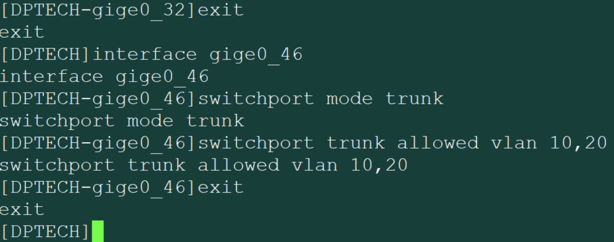
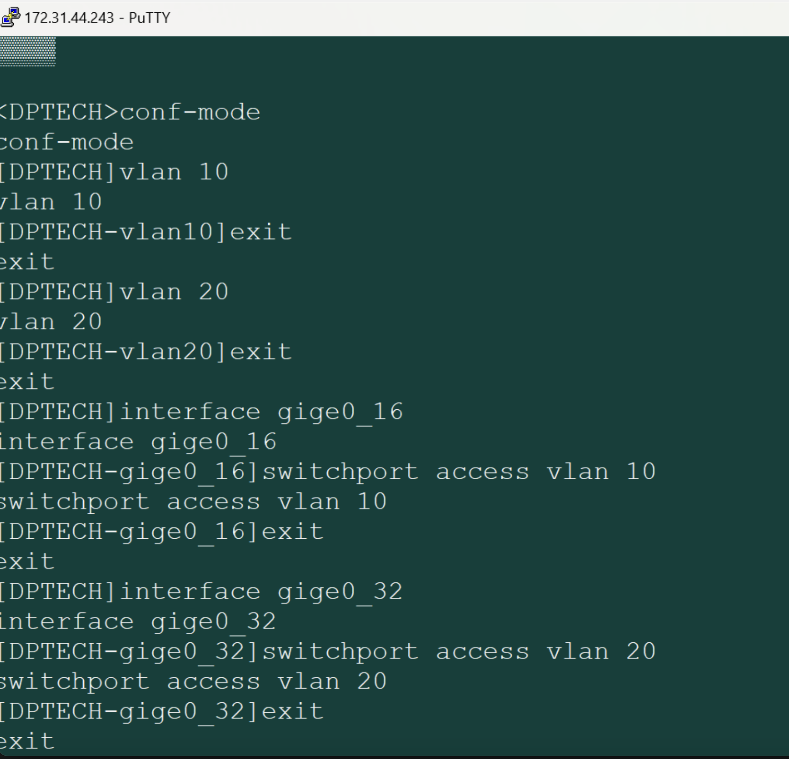
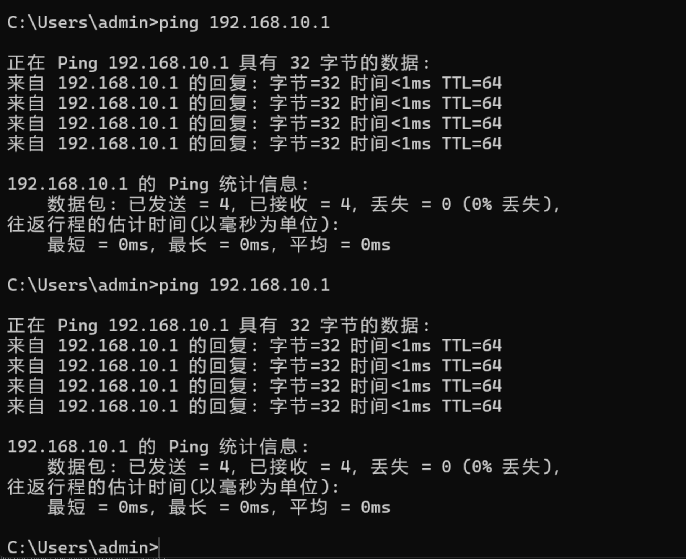

<h1 align = "center" style="font-size:40px">北京交通大学</h1>

<center style="font-size:18px">		课程名称：计算机网络原理</left>
<center style="font-size:18px">实验题目     ：Lab5_VLAN 交换机配置实验报告</center>
<center style="font-size:18px">学号    ：22281188</center>
<center style="font-size:18px">姓名 ： 江家玮</center>
<center style="font-size:18px">班级 ： 计科2204班</center>
<center style="font-size:18px">指导老师 ： 张志飞老师</center>
<center style="font-size:18px">报告日期 ：2025-05-29</center>


------

[TOC]


 <div style="page-break-after: always;"></div>

# Lab5 VLAN 交换机配置实验报告

## 一、实验时间

2025-05-29 10:00-11:00

## 二、实验地点

实验地点：北京交通大学九教北401内

## 三、实验目的

本次实验旨在深入理解VLAN（虚拟局域网）的技术背景与基本原理，并通过实际操作，熟悉VLAN的配置方法和常用命令。我希望能够掌握在交换机上划分VLAN的具体步骤，并理解不同VLAN间以及VLAN内部的通信机制。通过搭建VLAN实验环境，我期望能进一步熟悉交换机的工作原理和基本配置方法，从而提升网络配置与管理的实践能力。

## 四、实验内容

### 4.1 实验过程

本次实验主要围绕VLAN的划分与配置展开，旨在通过实际操作加深对VLAN技术原理的理解。实验中，我与队友协同完成了两台DPtech LSW3600交换机（LSW-A和LSW-B）以及四台PC（PC-A, PC-B, PC-C, PC-D）的互联互通配置。

我的实验流程是：

1. **VLAN基本配置（Access和Trunk模式）：**

   - **LSW-B配置（我负责）：** 我首先在我本地的Putty终端上连接到LSW-B交换机，进入配置模式。

     - 创建VLAN 10和VLAN 20：

       ```
       <DPTECH> conf-mode
       [DPTECH] vlan 10
       [DPTECH-vlan10] exit
       [DPTECH] vlan 20
       [DPTECH-vlan20] exit
       ```

     - 配置VLAN端口：将连接PC-B的Gige0/16端口划入VLAN 10，将连接PC-D的Gige0/32端口划入VLAN 20。

       ```
       [DPTECH] interface gige0/16
       [DPTECH-gige0/16] switchport access vlan 10
       [DPTECH-gige0/16] exit
       [DPTECH] interface gige0/32
       [DPTECH-gige0/32] switchport access vlan 20
       [DPTECH-gige0/32] exit
       ```

     - 配置Trunk端口：将连接LSW-A的Gige0/46端口配置为Trunk模式，并允许VLAN 10和VLAN 20通过。

       ```
       [DPTECH] interface gige0/46
       [DPTECH-gige0/46] switchport mode trunk
       [DPTECH-gige0/46] switchport trunk allowed vlan 10, 20
       [DPTECH-gige0/46] exit
       ```

   - **LSW-A配置（队友负责）：** 队友也在通过Putty终端连接并进行了相应的配置。

     - 创建VLAN 10和VLAN 20。
     - 配置VLAN端口：将连接PC-A的Gige0/16端口划入VLAN 10，将连接PC-C的Gige0/32端口划入VLAN 20。
     - 配置Trunk端口：将连接LSW-B的Gige0/46端口配置为Trunk模式，并允许VLAN 10和VLAN 20通过。

   2. **设备连接与初始配置：**

   - 然后，我与队友按照实验拓扑图连接了设备。
   - 接着，我负责配置了PC-B的IP地址为192.168.10.2/24，而队友则负责配置了PC-A (192.168.10.1/24)、PC-C (192.168.10.3/24) 和PC-D (192.168.10.4/24) 的IP地址。
   - 在IP地址配置完成后，我们进行了首次互通性测试，确认所有PC之间可以互相ping通。

   - 在双方配置完成后，我们互相进行了ping测试，验证了同一VLAN内的PC可以互通，而不同VLAN间的PC无法互通。

## 五、实验结果







## 六、实验心得

本次实验中遇到了很多问题：

原本带了mac过去发现无法安装putty，然后重新借了同学的win本进行操作

在更改本地ip地址的时候，更改了wlan的ip而不是有线的，导致最后更改的有线的地址导致出现占用错误

之后互相ping的时候由于一方防火墙没有关导致连接超时

最后还出现了ping的时候，出错，最后我们怀疑是端口问题，重新插了其他的口终于互相连接成功。

