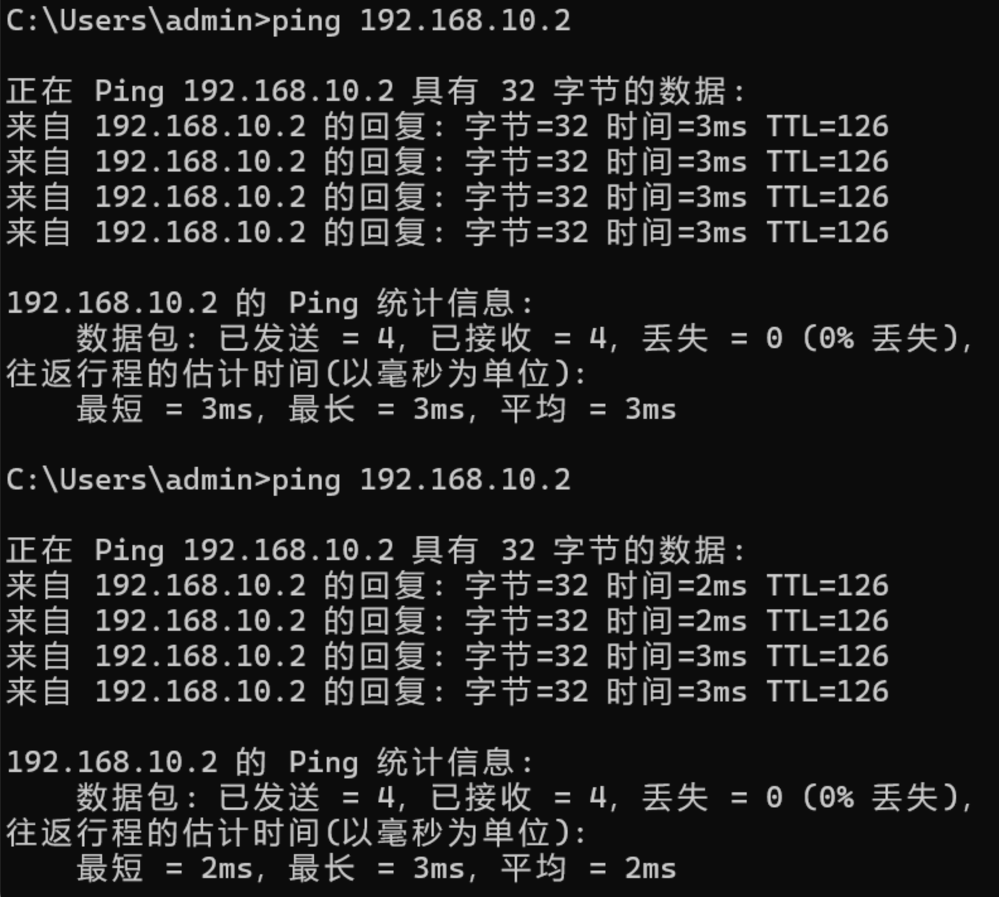

<h1 align = "center" style="font-size:40px">北京交通大学</h1>

<center style="font-size:18px">     课程名称：计算机网络原理</center>
<center style="font-size:18px">实验题目     ：Lab6_RIP 配置实验</center>
<center style="font-size:18px">学号    ：22281188</center>
<center style="font-size:18px">姓名 ： 江家玮</center>
<center style="font-size:18px">班级 ： 计科2204班</center>
<center style="font-size:18px">指导老师 ： 张志飞老师</center>
<center style="font-size:18px">报告日期 ：2025-06-03</center>

------

[TOC]

 <div style="page-break-after: always;"></div>

# Lab6 RIP 配置实验

## 一、实验时间

2025-06-03 08:00-09:00

## 二、实验地点

实验地点：北京交通大学九教北401内

## 三、实验目的

本次实验的主要目的是：
1.  理解并掌握 RIP (Routing Information Protocol) 的基本工作原理。
2.  熟练掌握在 DPtech 交换机上进行 RIP 的基本配置方法。
3.  通过实际操作加深对动态路由协议的认识。

## 四、实验内容

本次实验的核心内容是在两台支持三层路由功能的 DPtech LSW3600 交换机（LSW-A 和 LSW-B）之间配置 RIP 协议，以实现不同网段之间的互联互通。实验拓扑结构如下：

```
  PC-A (192.168.10.2/24) ---|         LSW-A         |--- PC-B (192.168.20.2/24)
  PC-C (192.168.10.3/24) ---| (gige0/16, gige0/32)  |--- PC-D (192.168.20.3/24)
  PC-E (192.168.10.4/24) ---|                       |
                            | VLAN 10: 192.168.10.1 |
                            | VLAN 100: 192.168.100.1|
                            |       (gige0/46)      |
                            |         TRUNK         |
                            |       (gige0/46)      |
                            | VLAN 20: 192.168.20.1 |
                            | VLAN 100: 192.168.100.2|
  (Gateway: 192.168.10.1)   |         LSW-B         |   (Gateway: 192.168.20.1)
                            | (gige0/16, gige0/32)  |
```

### 4.1 实验过程

我按照实验指导书的步骤进行了操作：

**1. 配置交换机 LSW-B：**
   我在`putty`连接到 LSW-B 并进行了如下配置：

   * **创建 VLAN：**

     ```
     vlan 20
     exit
     vlan 100
     exit
     ```

        * **配置 VLAN 接入端口：**

     ```
     interface gige0/16
     switchport access vlan 20
     exit
     interface gige0/32
     switchport access vlan 20
     exit
     ```

        * **配置 Trunk 端口：**

     ```
     interface gige0/46
     switchport mode trunk
     switchport trunk allowed vlan 20, 100
     exit
     ```

        * **配置 VLAN 接口 IP 地址 (SVI)：**

     ```
     interface vlan-if 20
     ip address 192.168.20.1 255.255.255.0
     exit
     interface vlan-if 100
     ip address 192.168.100.2 255.255.255.0
     exit
     ```

        * **配置 RIP 路由：**

     ```
     router rip
     network 192.168.20.0/24
     network 192.168.100.0/24
     exit
     ```

**2. 配置交换机 LSW-A：**
  队友执行了以下配置：

    * **创建 VLAN：**
        ```
        vlan 10
        exit
        vlan 100
        exit
        ```
        * **配置 VLAN 接入端口：**
        ```
        interface gige0/16
        switchport access vlan 10
        exit
        interface gige0/32
        switchport access vlan 10
        exit
        ```
        *(最初 PC-E 未指定端口，后续根据测试需要将其连接的端口，假设为 gige0/X，也划入 VLAN 10)*
        * **配置 Trunk 端口：**
        ```
        interface gige0/46
        switchport mode trunk
        switchport trunk allowed vlan 10, 100
        exit
        ```
        * **配置 VLAN 接口 IP 地址 (SVI)：**
        ```
        interface vlan-if 10
        ip address 192.168.10.1 255.255.255.0
        exit
        interface vlan-if 100
        ip address 192.168.100.1 255.255.255.0
        exit
        ```
        * **配置 RIP 路由：**
        ```
        router rip
        network 192.168.10.0/24
        network 192.168.100.0/24
        exit
        ```

**3. 而后去进行连线，再进行ping的操作**

## 五、实验结果

我`ping PC_A`, 可以连通。符合实验预期。



## 六、实验心得

通过本次 RIP 配置实验，我收获良多：

1.  **深化了对 RIP 原理的理解：** 我对 RIP 作为一种距离向量路由协议的工作方式有了更直观的认识，特别是它如何通过交换路由更新（包含目标网络、下一跳和 metric）来构建路由表。实验中观察到的 metric 值为 2，也印证了 RIP 认为直连网络 metric 为 1，每经过一个路由器 metric 加 1 的规则。
2.  **掌握了三层交换机 RIP 的基本配置：** 我学会了在 DPtech 交换机上进行 VLAN划分、SVI (Switch Virtual Interface) 配置以及启用 RIP 进程并宣告网络的基本命令。这些都是网络工程中非常实用的技能。
3.  **理解了路由与 VLAN 结合的重要性：** 实验中 PC-E 在划入正确 VLAN 前后 ping 测试结果的差异，让我深刻体会到三层交换中 VLAN 配置是实现路由的前提。只有当端口正确划分到 VLAN，并且该 VLAN 拥有 SVI 作为网关，RIP 才能基于这些接口宣告和学习路由。
4.  **提升了网络故障排查能力：** 在配置和测试过程中，如果出现连通性问题，我会首先检查 IP 配置、VLAN 划分、Trunk 配置，然后查看路由表 (`show ip route`)，分析 RIP 是否学习到了正确的路由条目。这个过程锻炼了我的逻辑思维和排错能力。
5.  **认识到动态路由的优势：** 相较于静态路由，RIP 能够自动发现和适应网络拓扑的变化（尽管本次实验未涉及拓扑变化测试）。这让我对动态路由在简化网络管理和提高网络鲁棒性方面的优势有了更深的体会。

实验过程中，确保每个配置步骤的准确性非常重要，一个小小的笔误（如 IP 地址、VLAN ID 或宣告的网络号）都可能导致实验失败。
